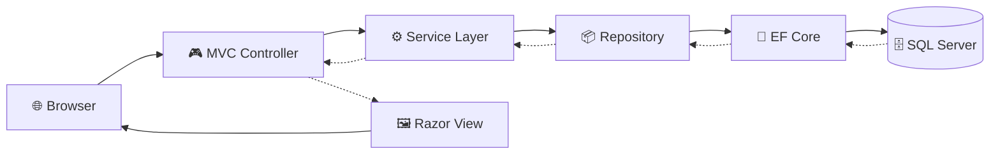
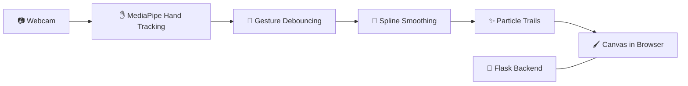
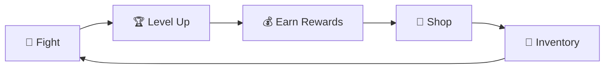
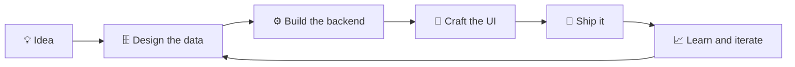

<!-- ╔══════════════════════════════════════════════════════════════╗ -->
<!-- ║                          HEADER                              ║ -->
<!-- ╚══════════════════════════════════════════════════════════════╝ -->


<div align="center">

<a href="https://github.com/aftabshakar95-sudo">
  
</a>

<br/>


<br/><br/>

<a href="https://github.com/aftabshakar95-sudo/portfolio">
  
</a>
<a href="https://www.linkedin.com/in/aftab-ahmad-99a0343a5">
  
</a>
<a href="mailto:aftabshakar95@gmail.com">
  
</a>
<a href="https://github.com/aftabshakar95-sudo">
  
</a>

<br/><br/>


<br/><br/>

<!-- QUICK NAV -->
<a href="#about"></a>
<a href="#stack"></a>
<a href="#projects"></a>
<a href="#deep-dives"></a>
<a href="#architecture"></a>
<a href="#skills"></a>
<a href="#principles"></a>
<a href="#stats"></a>
<a href="#connect"></a>

</div>


<!-- ╔══════════════════════════════════════════════════════════════╗ -->
<!-- ║                            ABOUT                             ║ -->
<!-- ╚══════════════════════════════════════════════════════════════╝ -->

<a name="about"></a>


<div align="center">
  
</div>

<br/>

<table align="center">
<tr>
<td width="55%" valign="top">

**Software Engineering student at UET Lahore** who learns by building. I enjoy backend architecture, clean relational design, and turning game ideas into working browser projects, with animation handled in pure CSS rather than heavy frameworks.

<br/>

| | |
|---|---|
| 📍 **Location** | Lahore, Pakistan |
| 🎓 **Education** | BS Software Engineering · 3rd Semester |
| 💻 **Role** | Full-Stack Developer and Game Enthusiast |
| 🔭 **Building** | MERN apps and browser games |
| 🌱 **Learning** | System Design · Computer Vision · Cloud |
| 🧭 **Motto** | Learn by shipping real projects |
| 📫 **Reach me** | aftabshakar95@gmail.com |

</td>
<td width="45%" valign="top">

### 🎯 Focus Areas

🔹 ASP.NET Core MVC + SQL Server<br/>
🔹 MERN Stack Development<br/>
🔹 CSS-Animated Game UIs<br/>
🔹 Database Design and Optimization<br/>
🔹 Repository and Service Patterns<br/>
🔹 RESTful API Development<br/>
🔹 Docker Containerization

<br/>

### ⚡ Fun Facts

🎮 I build games with CSS animations<br/>
🗃️ I design database-driven RPG systems<br/>
✋ I made a drawing app you control with hand gestures

</td>
</tr>
</table>

<details>
<summary><b>💬 Ask me about...</b></summary>
<br/>

<div align="center">

| Topic | Why |
|:---|:---|
| **ASP.NET Core MVC** | My main backend framework for games and banking systems |
| **SQL Server and T-SQL** | Stored procedures, triggers, normalization |
| **Entity Framework Core** | Migrations and optimization |
| **CSS game UIs** | Animated characters and attacks without frameworks |
| **MERN stack** | What I am building with right now |
| **Hand-tracking apps** | PhantomInk with MediaPipe and Flask |

</div>

</details>


<!-- ╔══════════════════════════════════════════════════════════════╗ -->
<!-- ║                          TECH STACK                          ║ -->
<!-- ╚══════════════════════════════════════════════════════════════╝ -->

<a name="stack"></a>


<div align="center">
  
</div>

<br/>

<div align="center">

| | |
|:---:|:---|
| **Languages** |  |
| **Backend** |  |
| **Frontend** |  |
| **Databases** |   |
| **Tools** |  |
| **Libraries** |   |

</div>

<details>
<summary><b>🧩 Which tech shows up in which project</b></summary>
<br/>

<div align="center">

| Technology | RealmOfLegends | Shinobi Arena | NexaBank | PhantomInk |
|:---|:---:|:---:|:---:|:---:|
| ASP.NET Core / MVC | ✅ | ✅ | ✅ | |
| Entity Framework Core | ✅ | | | |
| SQL Server | ✅ | | ✅ | |
| CSS animations | ✅ | ✅ | | |
| Python and Flask | | | | ✅ |
| MediaPipe | | | | ✅ |
| Repository and Service patterns | ✅ | | | |

</div>

</details>


<!-- ╔══════════════════════════════════════════════════════════════╗ -->
<!-- ║                       FEATURED PROJECTS                      ║ -->
<!-- ╚══════════════════════════════════════════════════════════════╝ -->

<a name="projects"></a>


<div align="center">
  
</div>

<br/>

<table align="center">
<tr>
<td width="50%" valign="top">

### 🗡️ RealmOfLegends
*Dark fantasy RPG web game*

⚔️ Turn-based combat with animated UI<br/>
🛒 Dynamic shop and inventory management<br/>
🏗️ Layered architecture (Repository + Service)<br/>
🎨 Custom animated components, no CSS frameworks<br/>
🗃️ Database-driven game state


</td>
<td width="50%" valign="top">

### ⚔️ Shinobi Arena
*Browser combat game*

🥷 CSS-drawn characters, no image assets<br/>
💥 Animated attack types<br/>
📊 Level-based combat and player progression<br/>
🎮 Shop and inventory tied to advancement

<br/>


</td>
</tr>
<tr>
<td width="50%" valign="top">

### 🏦 NexaBank
*Banking management system*

👥 Customer management and account operations<br/>
💰 Transaction processing and reporting<br/>
📊 Loan management system<br/>
🎨 Custom dark-themed interface


</td>
<td width="50%" valign="top">

### 🎨 PhantomInk
*Gesture-controlled drawing app*

✋ Real-time hand tracking via webcam<br/>
🎯 Gesture debouncing for accuracy<br/>
✨ Particle trail effects<br/>
📐 Spline smoothing for fluid strokes


</td>
</tr>
</table>


<!-- ╔══════════════════════════════════════════════════════════════╗ -->
<!-- ║                          DEEP DIVES                          ║ -->
<!-- ╚══════════════════════════════════════════════════════════════╝ -->

<a name="deep-dives"></a>


<div align="center">
  
</div>

<br/>

<details>
<summary><b>🗡️ RealmOfLegends: dark fantasy RPG</b></summary>
<br/>

| | |
|:---|:---|
| **Type** | Web game with a persistent database |
| **Stack** | ASP.NET Core MVC, Entity Framework Core, SQL Server |
| **Architecture** | Layered, using Repository and Service patterns |
| **UI** | Custom animated components, built without CSS frameworks |

**Features**

- ⚔️ Turn-based combat system with animated UI
- 🛒 Dynamic shop and inventory management
- 🏗️ Clear separation between controllers, services and data access
- 🎨 Hand-written animations instead of a UI kit

**What it demonstrates**

- Designing a relational schema for game data
- Keeping business rules out of controllers
- Building polished UI with plain CSS

</details>

<details>
<summary><b>⚔️ Shinobi Arena: browser combat game</b></summary>
<br/>

| | |
|:---|:---|
| **Type** | Browser-based combat game |
| **Stack** | ASP.NET MVC, CSS animations |
| **Visuals** | Characters drawn entirely in CSS |
| **Progression** | Level-based combat tied to a shop and inventory |

**Features**

- 🥷 CSS-drawn characters with animated attack types
- 📊 Level-based combat with player progression
- 🎮 Shop and inventory system tied to advancement

**What it demonstrates**

- Animation and layout skills using only CSS
- Connecting gameplay progression to a backend system

</details>

<details>
<summary><b>🏦 NexaBank: banking management system</b></summary>
<br/>

| | |
|:---|:---|
| **Type** | Management web application |
| **Stack** | ASP.NET Core MVC, SQL Server |
| **Theme** | Custom dark interface |
| **Domain** | Customers, accounts, transactions, loans |

**Features**

- 👥 Customer management and account operations
- 💰 Transaction processing and reporting
- 📊 Loan management system
- 🎨 Custom dark-themed interface

**What it demonstrates**

- Modelling a multi-entity business domain in SQL Server
- Building CRUD-heavy workflows with reporting

</details>

<details>
<summary><b>🎨 PhantomInk: gesture-controlled drawing</b></summary>
<br/>

| | |
|:---|:---|
| **Type** | Real-time computer vision web app |
| **Stack** | Python, Flask, MediaPipe |
| **Input** | Webcam hand tracking |
| **Output** | Smooth strokes with particle trails |

**Features**

- ✋ Real-time hand tracking via webcam
- 🎯 Gesture debouncing for accuracy
- ✨ Particle trail effects
- 📐 Spline smoothing for fluid strokes

**What it demonstrates**

- Working with real-time input that is noisy by nature
- Turning raw tracking points into smooth, usable output

</details>


<!-- ╔══════════════════════════════════════════════════════════════╗ -->
<!-- ║                         ARCHITECTURE                         ║ -->
<!-- ╚══════════════════════════════════════════════════════════════╝ -->

<a name="architecture"></a>


<div align="center">
  
</div>

<br/>

<details open>
<summary><b>🗡️ RealmOfLegends and 🏦 NexaBank: layered ASP.NET Core architecture</b></summary>
<br/>



Controllers stay thin, business rules live in services, and repositories are the only layer that talks to the database.

</details>

<details>
<summary><b>🎨 PhantomInk: gesture-to-stroke pipeline</b></summary>
<br/>



Debouncing filters out accidental gesture flickers, and spline smoothing turns jittery hand points into fluid strokes.

</details>

<details>
<summary><b>⚔️ Game loop shared by my RPG and arena projects</b></summary>
<br/>



Combat, progression, shop and inventory feed into each other so every fight changes what the player can do next.

</details>

<details>
<summary><b>🔄 How I like to build a project</b></summary>
<br/>



</details>

<details>
<summary><b>🧪 Illustrative code patterns (examples, not copied from my repos)</b></summary>
<br/>

**Repository and Service pattern in C#**

```csharp
public interface IItemRepository
{
    Task<Item?> GetByIdAsync(int id);
    Task<IReadOnlyList<Item>> GetAllAsync();
    Task AddAsync(Item item);
}

public class ShopService
{
    private readonly IItemRepository _items;

    public ShopService(IItemRepository items) => _items = items;

    public async Task<bool> CanAffordAsync(int itemId, int playerGold)
    {
        var item = await _items.GetByIdAsync(itemId);
        return item is not null && playerGold >= item.Price;
    }
}
```

**Gesture debouncing idea in Python**

```python
class GestureDebouncer:
    """Only confirm a gesture after it holds for N consecutive frames."""

    def __init__(self, required_frames=5):
        self.required = required_frames
        self.current = None
        self.count = 0

    def update(self, gesture):
        if gesture == self.current:
            self.count += 1
        else:
            self.current, self.count = gesture, 1
        return self.current if self.count >= self.required else None
```

</details>


<!-- ╔══════════════════════════════════════════════════════════════╗ -->
<!-- ║                            SKILLS                            ║ -->
<!-- ╚══════════════════════════════════════════════════════════════╝ -->

<a name="skills"></a>


<div align="center">
  
</div>

<br/>

<table align="center">
<tr>
<td width="50%" valign="top">

#### 🗄️ Database and Backend
- Relational design and normalization
- T-SQL stored procedures and triggers
- Entity Framework Core migrations
- Query optimization
- Repository and Service patterns

#### ⚙️ Software Engineering
- OOP in C#
- Multi-project solution architecture
- Algorithm design and implementation
- Debugging complex applications

</td>
<td width="50%" valign="top">

#### 🎨 Frontend and UI
- Custom CSS animations and transitions
- Interactive UI components
- Responsive web design
- Game UIs without frameworks

#### 🧰 Dev Tools
- Git and GitHub version control
- Docker containerization
- RESTful API development
- Visual Studio and VS Code

</td>
</tr>
</table>


<!-- ╔══════════════════════════════════════════════════════════════╗ -->
<!-- ║                          PRINCIPLES                          ║ -->
<!-- ╚══════════════════════════════════════════════════════════════╝ -->

<a name="principles"></a>


<div align="center">
  
</div>

<br/>

<div align="center">

| 🚀 Ship real things | 🧱 Structure matters | 🎨 Details count |
|:---:|:---:|:---:|
| Every skill I learn goes into a working project | Clean layers make code easier to grow | Smooth animation turns a prototype into a product |

| 🗃️ Data first | 🔍 Debug patiently | 📚 Keep learning |
|:---:|:---:|:---:|
| A good schema saves hours later | Complex bugs are solved one layer at a time | System design, vision and cloud are next |

</div>


<!-- ╔══════════════════════════════════════════════════════════════╗ -->
<!-- ║                            STATS                             ║ -->
<!-- ╚══════════════════════════════════════════════════════════════╝ -->

<a name="stats"></a>


<div align="center">
  
</div>

<br/>

<div align="center">


<br/>


</div>


<!-- ╔══════════════════════════════════════════════════════════════╗ -->
<!-- ║                           CONNECT                            ║ -->
<!-- ╚══════════════════════════════════════════════════════════════╝ -->

<a name="connect"></a>


<div align="center">


<br/><br/>

<a href="https://www.linkedin.com/in/aftab-ahmad-99a0343a5">
  
</a>
<a href="mailto:aftabshakar95@gmail.com">
  
</a>
<a href="https://github.com/aftabshakar95-sudo/portfolio">
  
</a>
<a href="https://github.com/aftabshakar95-sudo">
  
</a>

<br/><br/>

*"Code is like humor. When you have to explain it, it's bad."* — Cory House

**Thanks for visiting! ⭐ Star my repos if you find them interesting.**

</div>


<!-- ╔══════════════════════════════════════════════════════════════╗ -->
<!-- ║                            FOOTER                            ║ -->
<!-- ╚══════════════════════════════════════════════════════════════╝ -->


