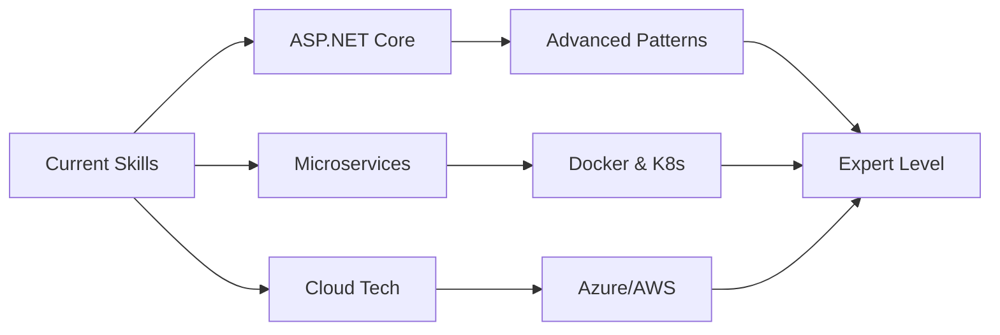

<div align="center">
  
# 👨‍💻 Aftab Ahmad


### Software Engineering Student | Full-Stack Developer | Problem Solver

[](https://git.io/typing-svg)

[](https://github.com/yourusername)
[](https://www.linkedin.com/in/yourprofile)
[](mailto:aftab.shakar95@gmail.com)

</div>

---

## 🚀 About Me

```typescript
const aftab = {
    location: "Pakistan 🇵🇰",
    role: "Software Engineering Student",
    education: "Bachelor of Science in Software Engineering",
    currentFocus: ["Full-Stack Development", "API Design", "Cloud Computing"],
    funFact: "I debug with console.log() and I'm not ashamed! 😄",
    lifePhilosophy: "Code is poetry written in logic"
};
```


### 💫 Quick Highlights

- 🔭 Currently working on **RESTful APIs** with ASP.NET Core
- 🌱 Learning **Microservices Architecture** and **Cloud Technologies**
- 👯 Looking to collaborate on **Open Source Projects**
- 💬 Ask me about **C#, .NET, Web Development**
- ⚡ Fun fact: **I love turning coffee into code!** ☕➡️💻

<br clear="right"/>

---

## 🛠️ Tech Stack & Skills

<div align="center">

### Languages


### Frameworks & Libraries


### Tools & Technologies


### Databases


### Operating Systems


</div>

---

## 📊 GitHub Statistics

<div align="center">
  


</div>

---

## 🚀 Featured Projects

<div align="center">

### 🎯 Student API
[](https://github.com/yourusername/StudentAPI)

A robust RESTful API built with ASP.NET Core for comprehensive student information management.

**✨ Key Features:**
- 🔐 Secure CRUD operations
- 📝 RESTful API design principles
- 🎨 Clean architecture patterns
- ⚡ Optimized performance

**🛠️ Tech Stack:** `ASP.NET Core` `C#` `.NET 10.0` `Entity Framework` `SQL Server`

---

### 🌟 Developer Profile
[](https://github.com/yourusername/yourusername)

Professional GitHub profile showcasing Markdown expertise and modern development practices.

**💡 Highlights:**
- 📱 Responsive design
- 🎨 Beautiful UI/UX
- 📊 Dynamic statistics
- 🔥 Animated elements

**🛠️ Tech Stack:** `Markdown` `Git` `GitHub` `HTML/CSS`

</div>

---

## 📈 Contribution Graph

<div align="center">
  


</div>

---

## 🎓 Education & Certifications

<table align="center">
<tr>
<td align="center" width="50%">

**🎓 Bachelor of Science**  
**Software Engineering**  
[Your University Name]  
📅 Expected Graduation: [Year]

</td>
<td align="center" width="50%">

**🏆 Certifications**  
✅ Git & GitHub (Lab 01)  
🔄 Version Control Fundamentals  
📚 More coming soon...

</td>
</tr>
</table>

---

## 🌱 Currently Learning

<div align="center">



</div>

- 🏗️ **Advanced ASP.NET Core Patterns** - Design patterns and best practices
- 🔄 **Microservices Architecture** - Building scalable distributed systems
- ☁️ **Cloud Technologies** - Azure and AWS fundamentals
- 🚀 **DevOps & CI/CD** - Automation and deployment pipelines
- 🧪 **Unit Testing** - TDD and testing best practices

---

## 💼 Professional Interests

<div align="center">

| 🌐 Web Development | 🔌 API Design | 🏛️ Software Architecture |
|:------------------:|:-------------:|:------------------------:|
| Building responsive and performant web applications | Crafting RESTful and GraphQL APIs | Designing scalable system architectures |

| 🤝 Open Source | 🎨 UI/UX | 🔐 Security |
|:--------------:|:--------:|:-----------:|
| Contributing to community projects | Creating beautiful interfaces | Implementing secure practices |

</div>

---

## 📫 Let's Connect!

<div align="center">

### 💬 Get in Touch

<a href="mailto:aftab.shakar95@gmail.com">
  
</a>
<a href="https://github.com/yourusername">
  
</a>
<a href="https://www.linkedin.com/in/yourprofile">
  
</a>
<a href="https://twitter.com/yourhandle">
  
</a>

### 📧 Email: aftab.shakar95@gmail.com

[](https://yourportfolio.com)

</div>

---

<div align="center">

### 💭 Random Dev Quote


### 😄 Here's a Joke for You!


---

### 👀 Profile Views


### ⭐ Show Some Love!

If you like my work, consider giving a ⭐ to my repositories!


**Happy Coding! 🚀**

</div>

---

<div align="center">
  
**💙 Thanks for visiting my profile!**


</div>
